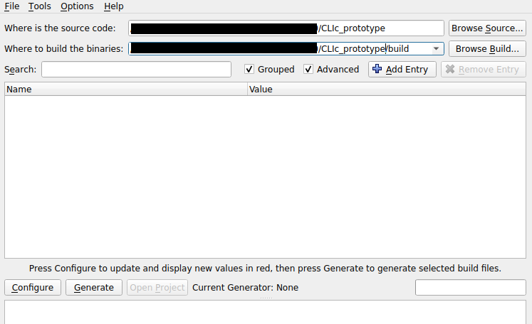
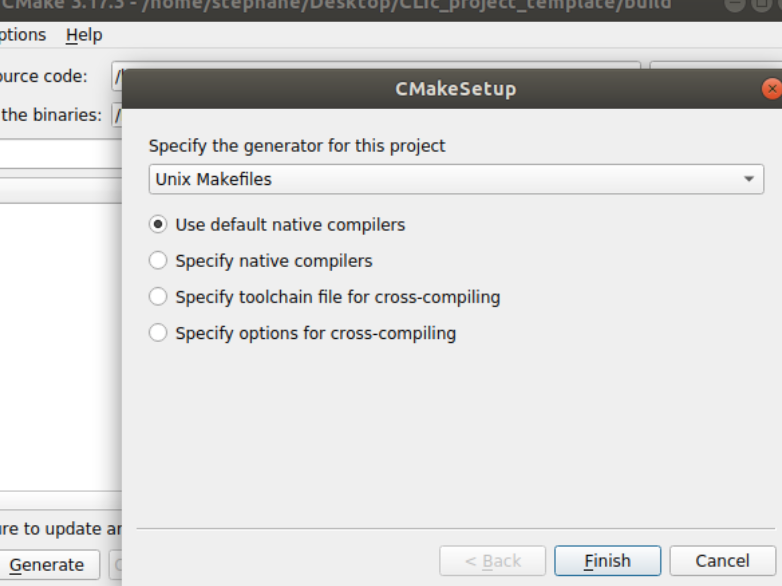
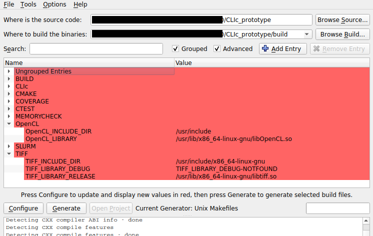
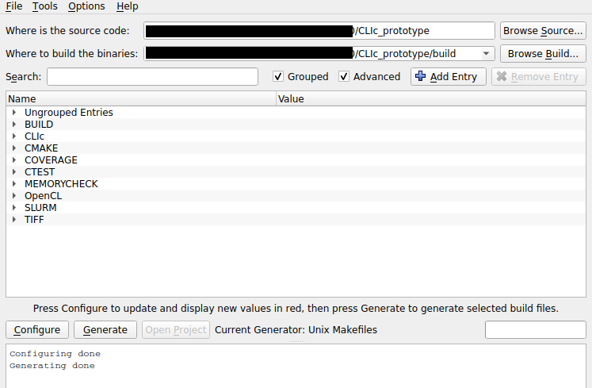

# CLIc compilation guide

CLIc is an openCL Image C++ API which allows you to run various image filters using GPU accelerated functions called kernels.

---
## Pre-requish

First of all, make sure that all the [pre-requish](./clic_prerequish_install.md) software and libraries are installed on you workstation.
- [LibTiff](http://www.simplesystems.org/libtiff/)
- [OpenCL](https://www.khronos.org/opencl/) 
(
    [Nvidia](https://developer.nvidia.com/cuda-downloads), 
    [AMD](https://github.com/GPUOpen-LibrariesAndSDKs/OCL-SDK/releases), 
    [Intel](https://software.intel.com/content/www/us/en/develop/tools/opencl-sdk.html)
)
- [CMake](https://cmake.org/)


---
## Guide

1. Clone the [CLIC repository](https://github.com/clEsperanto/CLIc_prototype) in your workspace and update submodule.
```
git clone git@github.com:clEsperanto/CLIc_prototype.git
cd CLIc_prototype
git submodule update --init --recursive
```
2. Start CMake (GUI)
    - specify the source folder 
    - specify the build folder
    - check boxes **advanced** and **grouped**
    


3. run the **Configure button**
    - (optional) create build folder (not needed if already created)
    - select the prefered generator (Unix makefile, VSC++, XCode, ...)
    - do not panic if you see a lot of red errors!



4. Unfold Tiff, OpenCL, and **Undefined groups**
5. if Tiff field are marked Not-Found
    - add path to tiff include folder to TIFF_INCLUDE_DIR 
    - add path to tiff library to TIFF_LIBRARY
6. if OpenCL field are marked Not-Found
    - add path to OpenCL include folder to OpenCL_INCLUDE_DIR 
    - add path to OpenCL library to OpenCL_LIBRARY
7. if CLIc field are marked Not-Found
    - add path to CLIc folder to CLIc_DIR 
8. if "build shared libs" is ticked, untick this checkbox
9. run the **Configure button** (again)



10. run the **Generate button**
11. compile and modify the project
    - (Unix makefile) run command *make* in the build folder
    - (Xcode/VSC++) open the project in the build folder and compile it




